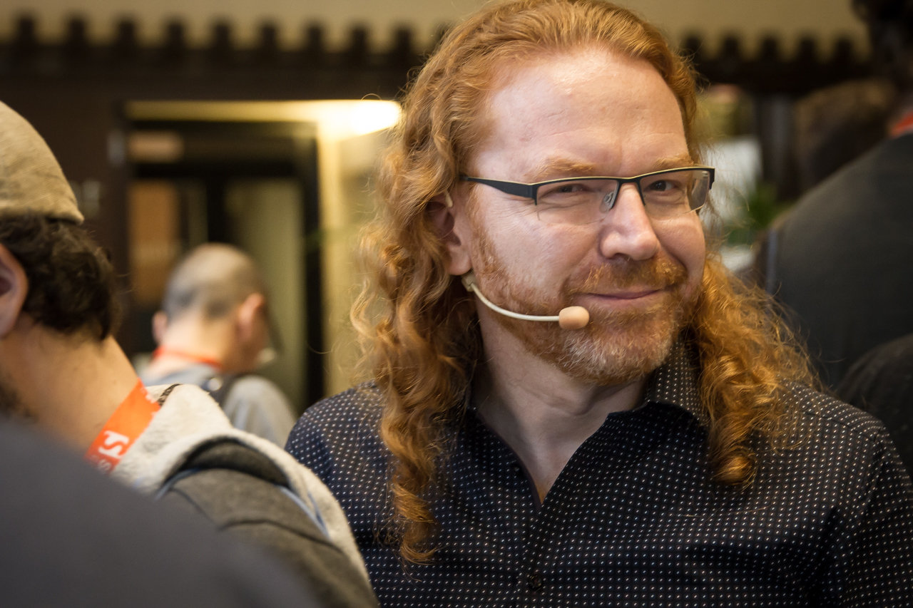

# 关于作者

克里斯蒂安・海尔曼（Christian Heilmann）作为一名网络开发者已经工作了 20 多年，在过去的 10 年里，他是雅虎、Mozilla 和微软等公司的开发者布道师 / 布道师。他平均每年在大约 20 个会议上发言，并领导由开发者和开发者布道师组成的团队。他出版了两本书，并为另外 6 本书做出了贡献。他曾是各种在线杂志的内容编辑，在他把网络当作自己的新家之前，他最初是一名电台记者。他从 2005 年开始在 [christianheilmann.com](https://christianheilmann.com/) 网站上行发表博客，你可以在 Twitter 上找到他，名字为 [codepo8](https://twitter.com/codepo8)。他曾在德国、印度、美国和英国生活和工作。他目前住在德国柏林，在微软担任首席项目经理。