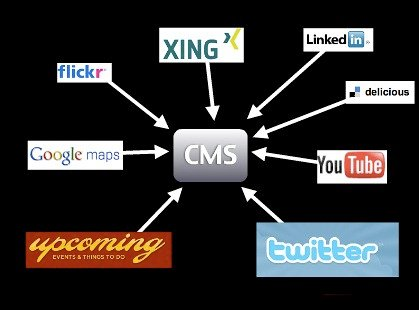

# 演示而不是描述

一旦你写好了你的内容并选择了正确的工具，就该写你的幻灯片了。如前所述，你应该记住的是，你的幻灯片不是你的演讲，而是它的纲要。幻灯片的作用是保持你的叙述流畅，并向听众说明你在演讲中这一点上的内容。

人类的交流在很大程度上是肢体语言，而你站在那里读你的幻灯片，或者更糟糕的是——转过身去看大屏幕上发生的事情，是一场交流的灾难。

除此之外，这还意味着你无法集中精力关注听众。观察观众和他们的肢体语言是做一个好的演讲的很大一部分。

> **事实**：演讲不是你庆祝自己和表演节目，而是你以一种吸引人和有趣的方式把信息带给观众。

只有当你能看到你的效果时，你才能做到这一点——而不是当你必须阅读你想说的东西时。

因此，你需要找到一句话，甚至一个词，一张图片，一个截图，一些图表或一些插图来解释和强调你在这段演讲中想谈的内容。你不会因为要读和看的东西而压倒听众，而是让他们能够专注于你。你在演讲中释放自己，如果需要的话，改变你的演讲风格，以阻止观众打瞌睡或离开。

让我们来看看很久以前的一个简单例子。以下是我所拥有的信息：

对数据之网感兴趣的方式是将我们自己分布在网络上，并将数据带回我们的网站。

第一步是在网上传播我们的内容：

-   上传照片到 Flickr
-   书签和标签的网址是 Delicious（你看这里是多久以前）
-   写短小精悍的更新，在 Twitter
-   上传视频到 YouTube
-   链接地址，并设置驾驶指示与 Google Maps
-   写简历和简历的地方是 Xing 或 LinkedIn

这种方法的好处如下：

-   数据分布在多个服务器上——即使你自己的网站离线（例如进行维护），数据仍然存在。
-   你可以接触到用户，并进入那些从未在你的网站上出现过的社区。
-   你从这些网站获得关于你内容的标签和评论。这些可以成为你将来在你的主网站上写相关副本的关键词和指南。你知道人们想听什么，而不是猜测。
-   在这些网站上的评论也意味着你开始了与网络用户的沟通渠道，这种沟通是自然发生的，而不是把他们导向一个复杂的联系表格。
-   你不需要担心将图片或视频资料转换为网络格式——那些正是为此目的而建立的网站会自动为你做这些。
-   你允许其他人将你的内容嵌入他们的产品中，从而可以搭上他们的成功和诚信。

与上述信息配套的两张幻灯片如下。

我没有讲述所有这些事情，而是让你了解，用公司的标志作为他们已经知道的东西，用几个箭头显示我想带来的东西。我能够逐一讲述这些服务，并说人们可以用它们做什么。然后，第二张幻灯片显示了在这些服务的完整性上捎带的好处。加上一个实际的例子，说明用这种方法可以做什么，你就有了一个很好的演讲环节。

> **警告：**正如你在这个例子中所看到的，在网络上传播你的信息可以成为一个相对短暂的经历。很多这样的服务现在已经不存在了，而我的博客仍在继续。当涉及到你在网络上的存在时，要记住的一个重要一点是，始终保持你的内容的本地拷贝，你可以在未来导入一个新的服务中。另外，如果你使用的任何服务没有给你导出数据的选项，这就是一个警告信号。