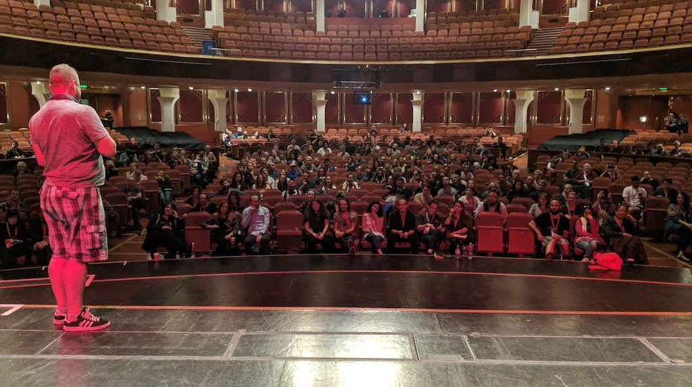

# 举办讲座或 workshop

一旦你确认被邀请去演讲，为各种技术故障做好了准备，就可以考虑发表你的演讲或workshop了。做正确的事情，因为数据是一回事，但以吸引人的方式提供数据则更有力量。

> **事实：**没有不好的学生或不好的听众，只有不好的研讨会和讲座。你的情绪、奉献和热情确实会成为观众的情绪——如果你不高兴，他们也不会高兴。

公开演讲是一门艺术，你可以从其他形式的表演中学到很多技巧，但最重要的还是要做好准备，并乐此不疲。必须有人向听众传达你要演讲的内容——如果你不做，销售人员就会做。在提供材料时，有几件事需要考虑。