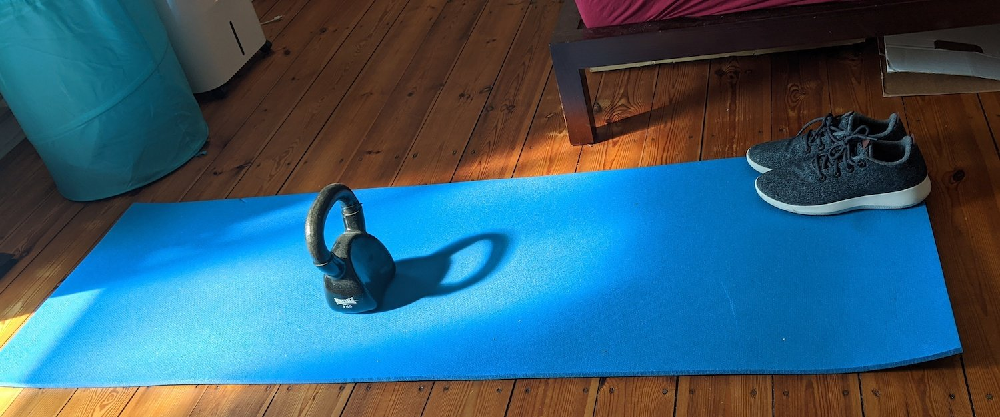

# 为演讲准备好优秀的幻灯片

**幻灯片是一件很棘手的事情**。它们的主要问题是，作为一个开发者布道师，大多面对的是技术听众，而幻灯片对我们来说是一种耻辱。术语"死于Powerpoint"不仅仅是一幅Dilbert漫画。可悲的是，我们在办公室的日常生活中，很多时候都是坐在一个房间里，试图让自己看起来精神抖擞，而当一些老派的演讲者向我们展示你能在一张幻灯片上塞进多少个要点时，我们的内心就会慢慢死去。

同样，和其他章节一样，你在这里读到的很多内容会随着你的经验和环境而变化，但我发现我在这里分享的东西对我把技术上的好处带给饥肠辘辘的、不受重视的开发者有帮助。此外，我的幻灯片在幻灯片分享平台上得到了很多良好的反馈和很高的浏览量，这可以说明我在做正确的事情。