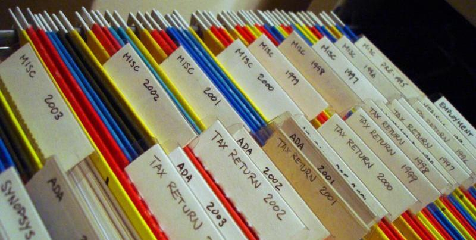

# 保存你的工作记录

Photo by Takashi Toyooka

大多数会议都会对您的演讲进行录像或录音，事后观看您的演讲非常重要。观察自己是一种改进的好方法，因为你很可能是你最糟糕的批评者。一个你不能生气的人。当我们说话时，我们的头脑会产生共鸣。这就是为什么我们如何听到自己的声音与别人听到的声音不同。重要的是要了解你所投射的人以及你自己，并确保你的表现随着时间的推移变得更好。做到这一点的一个方法是保留你所展示的所有东西的录音。

由于几个原因，为你的演讲和一般的工作进行录音是一个好主意。

-   **不能参加你的会议的人也能得到同样的信息**。对我来说，一个演讲远不止是幻灯片——幻灯片实际上只是演讲的目录。
-   **你有机会检查你在听众面前的表现**。我通常在健身房里骑自行车时用手机检查我的演讲——很好地利用了时间，我可以看到我需要改进的地方。
-   **喜欢音频或视频的人对你的工作感兴趣**。这也包括因病情需要音频和视频的人。
-   **人们喜欢在车里听录音**。视频就不是一个好主意。
-   **它允许你在其他渠道发布**，而不仅仅是你的博客或网站或会议档案。

如今，记录东西是非常容易的——大多数设备都有很好的麦克风和摄像头，甚至夹式麦克风和耳塞也变得更好、更实惠。