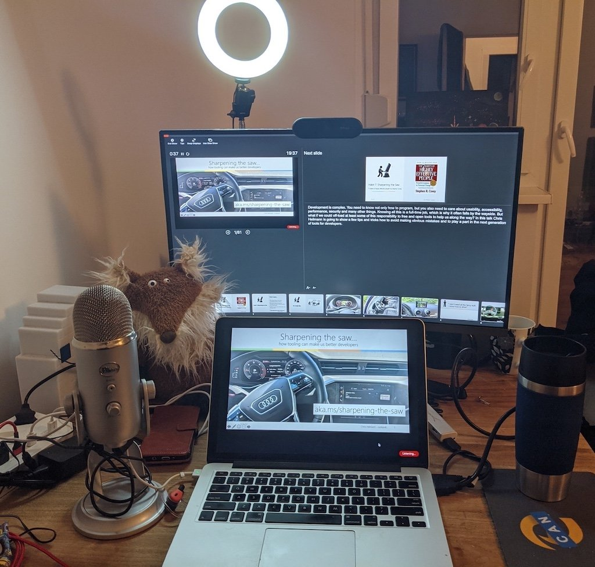

# 录制自己的演讲

相当多的线上会议在现场演讲方面体验并不好，会要求你对会议进行录音，然后把视频发给他们。这起初听起来可能令人生畏，但我惊喜地发现，你有很多选项可以录制和编辑自己的视频。几乎每一个幻灯片软件都有一个录制选项。

用什么取决于你自己，你可以四处看看并尝试一些东西。例如，我惊喜地发现，Powerpoint和Keynote都有一个录音选项。你可以在程序本身中为每张幻灯片添加视频录制和配音。还有一些浏览器扩展，允许你录制屏幕上的任何内容。

录制你的演讲并将其发送到会议上有几个好处：

-   你可以编辑问题，一点一点地记录演讲内容，而不是一次性地介绍。
-   你可以随心所欲地重新录制，以确保你能达到正确的长度。
-   在会议期间，您可以专注于即时聊天，看看人们说了些什么——保持记录也是一个好主意。
-   当谈到几乎每场线上讲座之后的现场问答时，你会感到精神振奋，并准备好解决这些问题，而不会因为早期可能出现的技术障碍而感到沮丧。
-   由于你定义了视频的质量和可及性，你可以不急于做一个真正的好工作。

当然，并非所有的事情都是完美和美好的。

对着自己的相机做报告可能比对着观众做报告感觉要艰难得多。听众也很可怕，但至少你能得到一些反馈。在自己的房间里对着镜头讲笑话，感觉很奇怪，更像是在演戏，而不是演讲。但这不应该影响你的兴奋度，你应该付出更多的努力，让自己显得更有激情，就像你在和观众交谈一样，这样才能拍出好的视频。虽然听起来很傻，但我通过与我桌子上的狐狸木偶交谈取得了很好的效果。别担心，他不会回答。

我倾向于制作很多版本的视频，对自己的批评比在讲台上时要严厉得多。在讲台上，你有压力的借口，一些"呃"和 "错误"或忘记一个细节是可以被原谅的。当你录制和提供视频时，感觉就不一样了。但是，再一次，人类的一点失败是可以留下的，而且会使你更令人喜欢和平易近人。我们不需要每件事都有完美的视频——我们需要一些令人兴奋的视频，因为这个人所展示的东西看起来是可重复和可联系的。

当谈到看电影时，我也喜欢看制作/幕后花絮，特别是爆笑片段。这让我看到，人类制造了我喜欢的东西，而且他们不得不与我们也在挣扎的所有问题作斗争。

通常情况下，我只是录制自己介绍幻灯片和通过一些演示，并没有做太多的编辑，因为这个原因。然而，我已经做了很长时间，对不完美的感觉很舒服。如果你刚开始，你可能要多花点功夫。

> **提示：**重要的是要记住，你发布的任何视频都是获得更多工作的潜在途径。许多会议组织者希望在邀请演讲者之前，至少看到他们的一段好视频。这意味着，你发布的任何视频都是一张名片。这就是为什么在你的幻灯片中保留你的联系信息也很重要。

以下是帮助我按时、高质量地录制讲座的几件事。