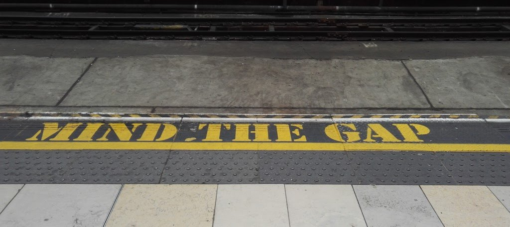

# 演讲技巧：时长把控

讲座和演讲是一个伟大的工具。它能让你以一种引人入胜的方式向听众展示令你兴奋的东西。听众会给你即时的反馈——很多是以肢体语言的形式。对我来说，这是作为一个开发者布道师的最令人愉快的部分之一。

> **事实**：任何伟大的演讲的开始是对主题的兴奋。如果你没有这种兴奋感，你还不如不出场。

我们在本手册中已经讲过几次了。在这一章中，我想讲讲演讲的另一个问题。注意时长，更重要的是——保持听众的兴趣。

下面的信息是围绕着会议上的演讲。演讲是你在节目中的档期，是独立的。而不是那些介绍研讨会或公司会议期间的演讲。我在这里要介绍的许多内容也适用于这些会议，但有一些不同的细微差别需要考虑到。