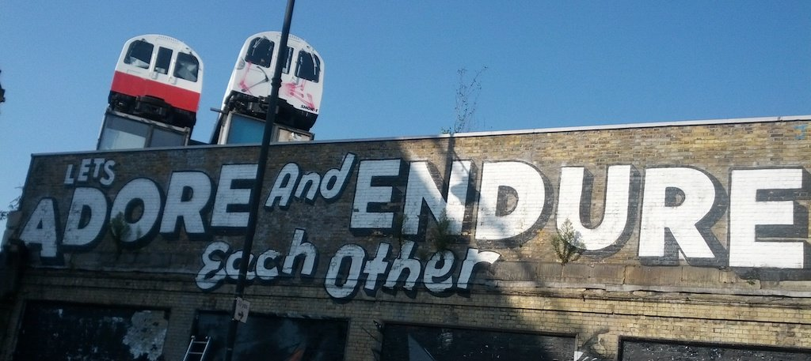

# 注意演讲措辞

这不是关于触发词或歧视性的表达方式。有很多这方面的信息，甚至有一些不错的[语义处理工具](http://alexjs.com/)可以使用。它也不是关于无意识的偏见。或者说，也许它是。习得性偏见是肯定的。

关于技术演讲中的一些话语，听起来令人鼓舞。实际上，它们可能将听众排除在外，使他们对自己的知识水平感到遗憾。以下是这些句子，我将详细解释如何用一些破坏性较小的句子来代替它们：

-   "这很容易......"
-   "我快速重复一遍，为了你们中少数不知道的人......"
-   "每个人都可以做到......"
-   "X解决了这个问题，所以你不必担心这个问题"
-   "众所周知......"
-   "这就是为什么Y（你的产品）比（竞争者）X好得多"
-   "这就像我们在学校学到的一样......"
-   "这可以用几行代码完成......"
-   "如果你想做到专业，就做X"

这些都不是妨碍你的表演，使你成为一个糟糕的演讲者。甚至可能有一些方法来使用它们，而不是混乱和破坏性的。这就是语言，在某些文化中，它们可能是可以使用的。我在这里不是要告诉别人。我在这里是要让你意识到，一些听起来不错的东西可能会让人感觉不好。而这不是我们作为演讲者的目的。

作为一个演讲者，你的工作不仅仅是提供技术信息。你还需要启发和娱乐。你常常通过简化事情和努力取悦他人而超越了目标。

重要的是要提醒自己，我们不能对我们的观众有太多的期待与假设。房间里可能都是专家，但视频记录也会发给每个人。以简单的方式解释事情，并不是让他们变笨。实际上，这可能是演讲者最困难的任务。

参加专家活动是很有压力的。作为一名听众，你不想显得比别人能力差。作为一个演讲者，情况更糟。演讲是一种平衡的行为。你既不想听起来居高临下，也不想让听众负担过重，更不想让人觉得自己很笨，显得太基本，还有......

我在很多活动中听到过以下的表达方式，我总是有点畏缩。通常情况下，它们是可以的，也没有什么坏处。但是，为了让演讲者做得更好，我们最好能更有意识地了解我们所做的事情以及它可能产生的影响。