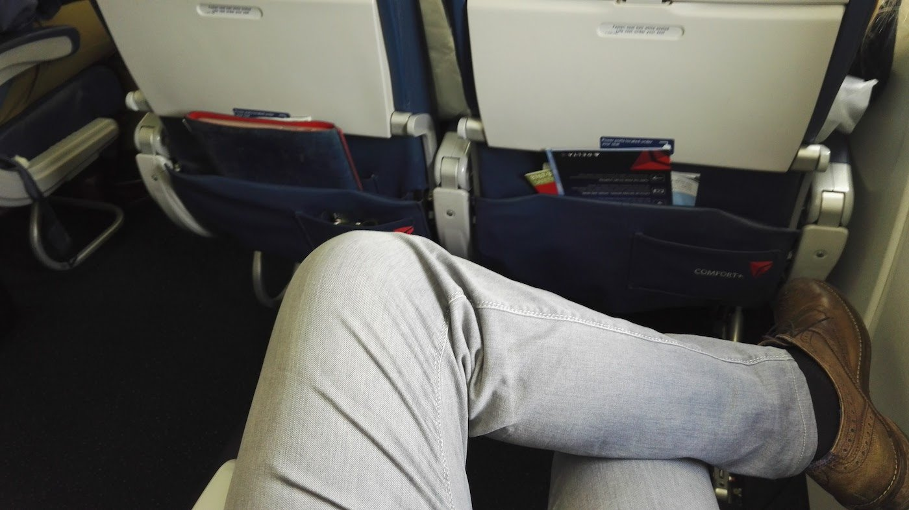

# 旅行和参加会议

会议和旅行是有压力的，这一点毋庸置疑。它们也可能是令人沮丧的。但对于布道师来说，这是工作，作为一个伟大的布道师，你应该认真对待。每一个都是如此。如果你不能认真对待活动，那就不要在那里发言。就像所有关于布道的事情一样，你的会议成功与否取决于你的兴奋程度。

你应该准备好你的演讲，并对听众进行研究。你应该看看其他发言人在做什么，谈论什么，以避免重叠。这就是为什么当别人把会议当作"办公室以外的时间"时，会让人感到恼火。而当组织问题意味着你在一个几乎是空的房间里结束时，情况会变得更糟。尽量避免这种情况。要像组织者和参会者对你在那里一样，对活动感到兴奋。每个伟大的布道师都应始终牢记以下事实。

> **事实是**：如果你被邀请在一个会议上发言，你应该出席会议。

人们花钱来看你，组织者依靠你来娱乐、宣传和教育。如果你不在活动现场，你就是在欺骗组织者和与会者。你不是一个可以唱一首歌就在保镖的掩护下离开的摇滚明星。你需要组织者和参会者来完成你的工作。这要以正确的方式计划你的活动行程开始。

与会议组织者保持联系，并预先提出正确的问题，这样你就可以独立到达会场，在正确的时间和正确的地点。主动提出要有灵活性，但要确保你不需要别人牵着你的手。给自己足够的时间，以便在会议需要你的时候出现。对于一个组织者来说，没有什么比找不到演讲者更有压力的了。