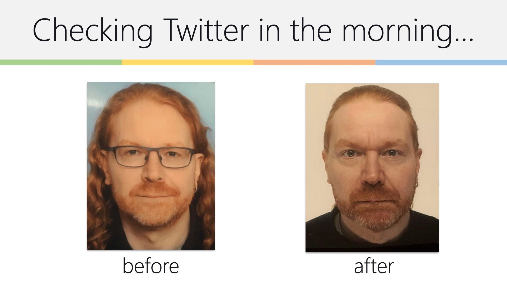

# 了解和使用社交网络

作为开发者布道师，网络是你最大的游乐场。它是一个全球性的、全天候的信息和交流渠道，使你能够将你的信息传递出去。

通过了解和使用社交网络，你还会发现其他人成为你伟大故事的中继者，人们甚至可能为你翻译并在自己的市场上发表。

社交媒体在过去几年里有了突飞猛进的发展，并占据了我们大量的时间。有人通过提供"社交媒体咨询"和 "增长黑客"培训赚了很多钱，这很容易让人联想到当年的"搜索引擎优化"，使用同样的技巧。虽然这些培训中所教授的技巧会给你带来即时的成功，但这种成功也会比你说的"炒作"更快消逝。

> **警告：**要注意这一点，你的工作是把网络作为一个交流和分销渠道，而不是在一周内赚快钱。这将扼杀你的声誉，正如之前所说，你的声誉、正直和诚实是使你成为开发者布道师的原因。失去这些将使你在未来几乎不可能得到倾听，这将使你对你的公司毫无用处，并败坏开发者布道这一行业的名声。