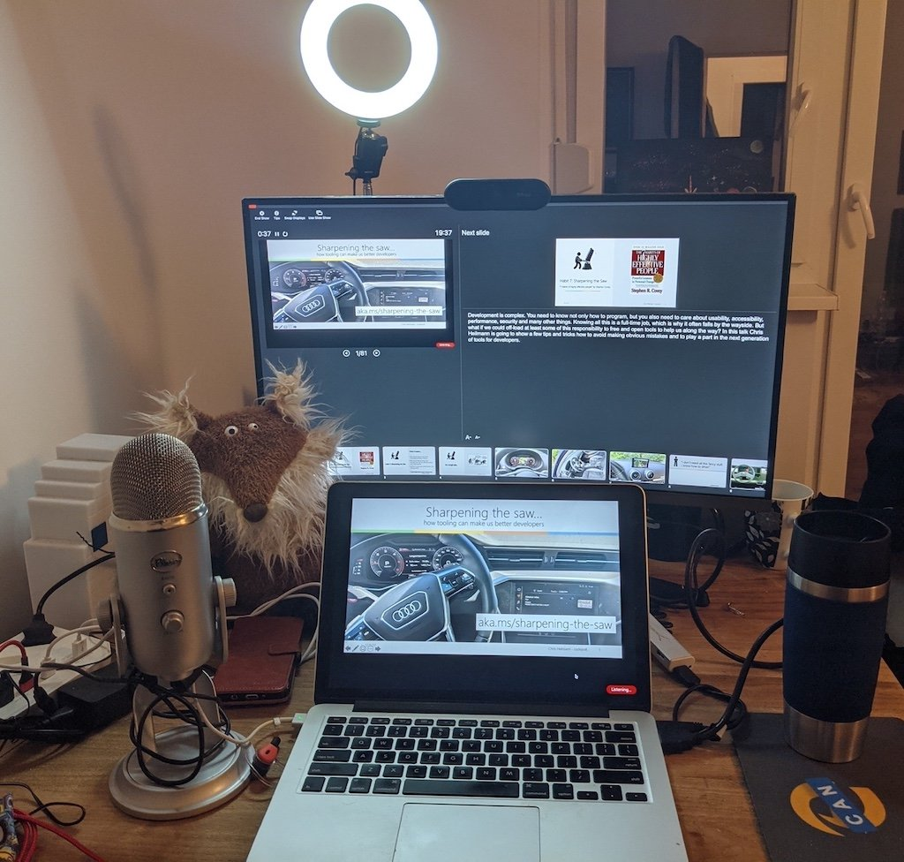

# 合宜的配置

大多数笔记本电脑都有所有你需要的东西，可以开始录制视频、截屏和在网上传播。为了获得真正高质量的录音，在一些额外的东西上投资一些钱是有意义的。

-   **外置麦克风**：如果你在自己的设备上做大量的录音或流媒体，花一些钱买一个外部麦克风是有意义的。因为它们的声音要好得多，并能阻隔外部噪音。外置麦克风的另一大好处是，你可以一边打字一边说话/录音，而不会因为键盘的点击声而烦扰听众。
-   **外接显示器**：拥有第二个显示器的好处是，你可以用一个屏幕来记录谈话，并在另一个屏幕上有你的演讲者笔记。把你想做录屏的应用程序放在第二台显示器上也比较简单，周围没有任何干扰。
-   **外置摄像机**：对于高端录音来说，有一个外置摄像机是很有意义的（这也是带去活动做一些快速采访的好办法），但从长远来看，你的手机也足够好。在副显示屏上安装摄像头也意味着你将有一个很好的中央摄像头位置，可以看到观众而不需要太多弯腰。
-   **适当的照明**：现在的LED环形灯真的很实惠，放在笔记本电脑或辅助显示器后面会有很好的效果。避免从后面进行任何照明。

以下是我这些天使用的东西。

正如你所看到的，没有多少东西是贵得离谱的，但我设法从中得到了一些好的结果。狐狸在那里做我看不到的观众。