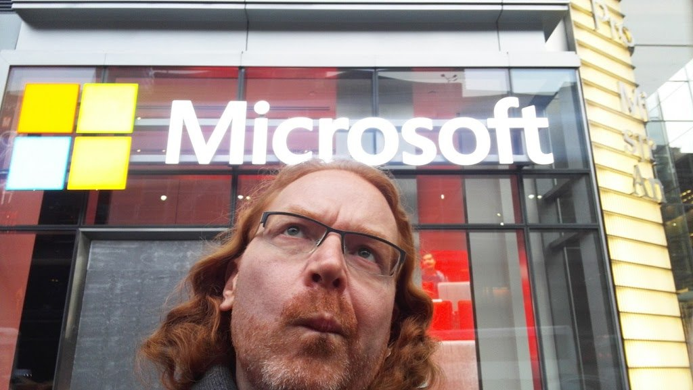

# 与自己的公司合作

作为一个开发者布道师，你会发现你的工作有很大一部分是与内部同事和公司不可预测的变化打交道。

这实际上可能是一项比与外部打交道更难的工作。原因是，内部的人对你所倡导的产品有更多的信息，也有不同的关系。

这可能意味着，虽然外部世界对某种产品感到兴奋，但内部的人却根本不为它感到骄傲。而在你认为没有做好的工作中得到表扬并不是一种好的感觉。它让你觉得人们根本不欣赏你的努力。

发布产品的过程可能是痛苦的、令人沮丧的，有时甚至是令人困惑的。例如，高度成功的产品可能会失血过多。这可能会导致公司的很多挫折，因为其他更有利可图或更有效的产品没有得到同样的资源。

作为开发者布道师，你的工作是倾听内部人士的意见，了解他们的问题，并与管理层沟通，试图解决这些问题。你还需要确保你提醒人们注意事实，而不是用不好的传言来插嘴。外部世界对公司和产品的评价不一定是真实的情况。

沮丧的人很可能会在社交媒体和其他地方说他们公司的坏话。这不仅对你的产品是个问题，也可能对他们的职业生涯是个坏的举动。通常情况下，你会发现自己是构建产品的人的挫折的传声筒，也是一个导师，让他们不要公开说他们以后可能会后悔的话。重要的是要建立一个声誉，让人们可以在没有反响的情况下对他们的工作进行发泄。这也是一个重要的步骤，可以验证开发者布道师职位对开发者的价值。毕竟，你是他们的代言人，对吗？

> **提示：**看到一家科技公司失败，对网络媒体来说是一件好事。它引起愤怒并带来大量的点击率。科技公司仍然被视为 "对普通人来说太聪明了 \" 或者 "可能是彻头彻尾的邪恶和傲慢 \"。由于在网上很容易查到某人在哪里工作，任何来自同事或来自你的不明智的话语都可能并将成为 "xx 公司员工说......" 这样的话，这使对你的公司的攻击更有说服力。不要落入这个陷阱，确保你不要让挫折感对你或你的同事产生影响。不断重复，你在那里为他们谈论他们工作中令人沮丧的部分。

当你是一个开发者布道师时，有很多事情你必须要注意。其中之一就是公司内部的敌人。