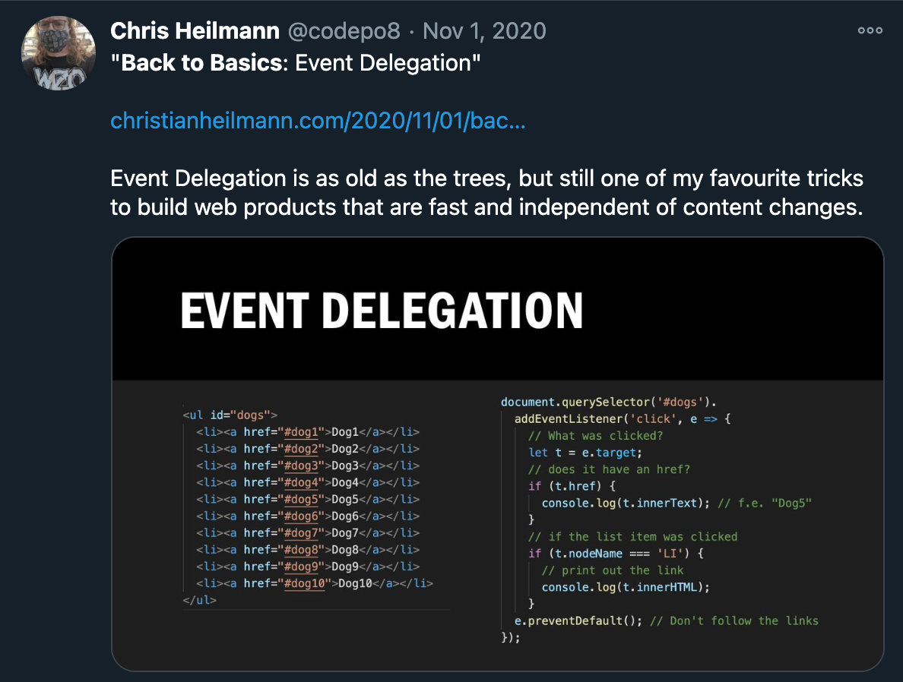

编写优秀的代码示例
==================

代码示例是使你的帖子和文章与开发者更相关的原因。它们比关于某个产品的几十页的文章更有意义，而且更重要的是——它们邀请人们去玩你的产品。你甚至可能经常发现自己在看一篇技术文章时直接滚动到第一个代码示例。

> **事实：**像StackOverflow这样的平台的成功表明，把解释保持在最低限度，让代码来说话是有意义的。这也产生了一个不幸的影响，许多开发者甚至不再理会代码的"原因"，而是乐于坚持"如何"，并将代码复制和粘贴到他们自己的产品中。我把这些人称为 "FullStackOverflow开发者"。